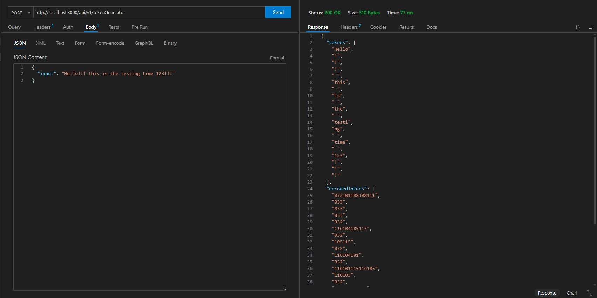

# Custom Tokenizer API 

A lightweight API that breaks text into tokens and encodes them into numeric values(ASCII). 


## 🛠 API Reference

#### Post

```http
  POST /api/v1/tokenGenerator
```
#### Request

| Body | Type     | Description                |
| :----- | :------- | :------------------------- |
| `input` | `string` | **Required**. Your Input string |

#### Response

| keys | Type     | Description                       |
| :-------- | :------- | :-------------------------------- |
| `tokens`      | `string[]` | Contains tokens of array of strings |
| `encodedTokens`      | `string[]` | Contains encoded tokens of array of strings |


## 🛠 Set Up and Run Locally

Clone the project

```bash
  git clone https://github.com/TrilochanSahoo/Token-Generator.git
```

Go to the project directory

```bash
  cd Token-Generator
```

Install dependencies

```bash
  npm install
```

Start the server

```bash
  node index.js
```
Or

```bash
  nodemon
```


## 📸 Demo Screenshots

Here’s how the API works in action:


## Screenshots
<p align="center">
  
</p>

